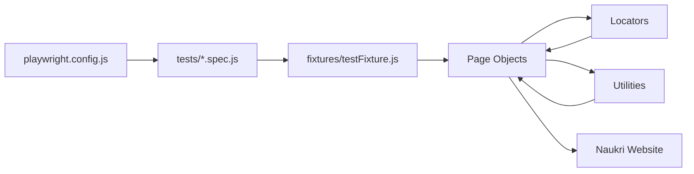
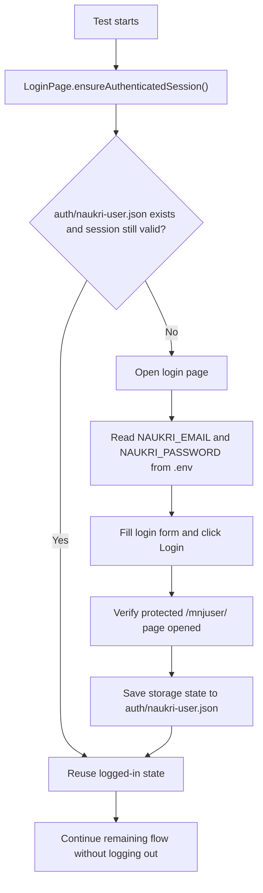
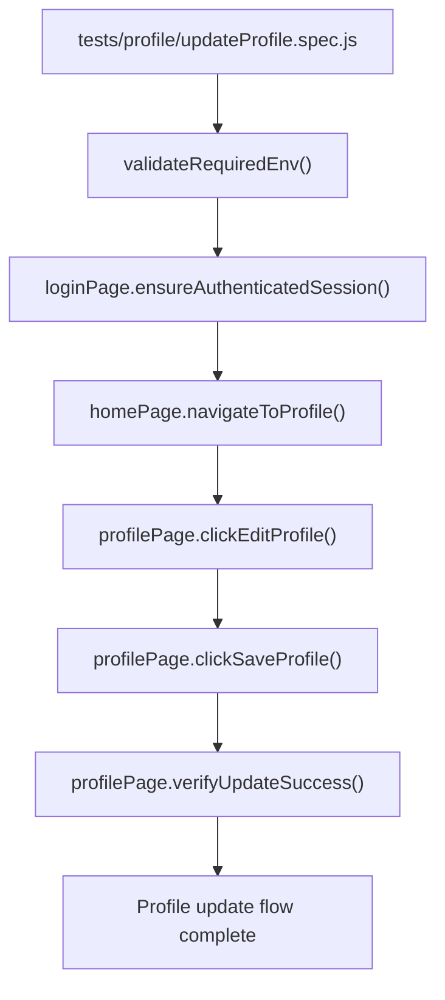
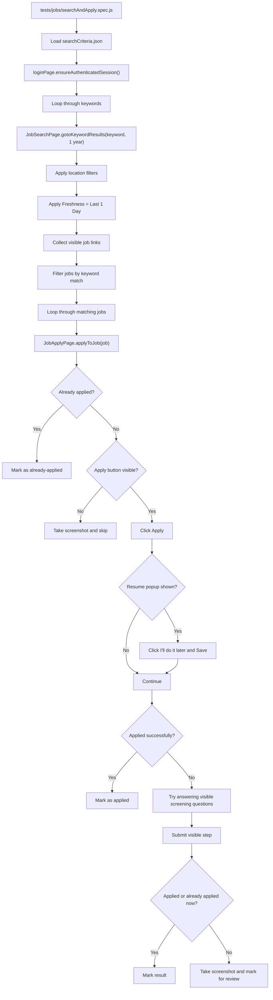
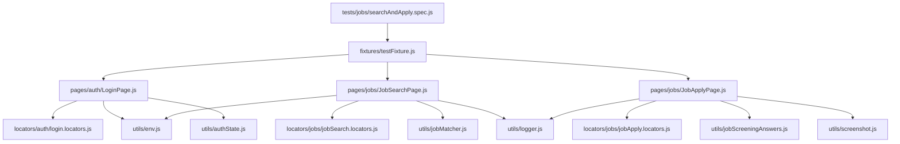
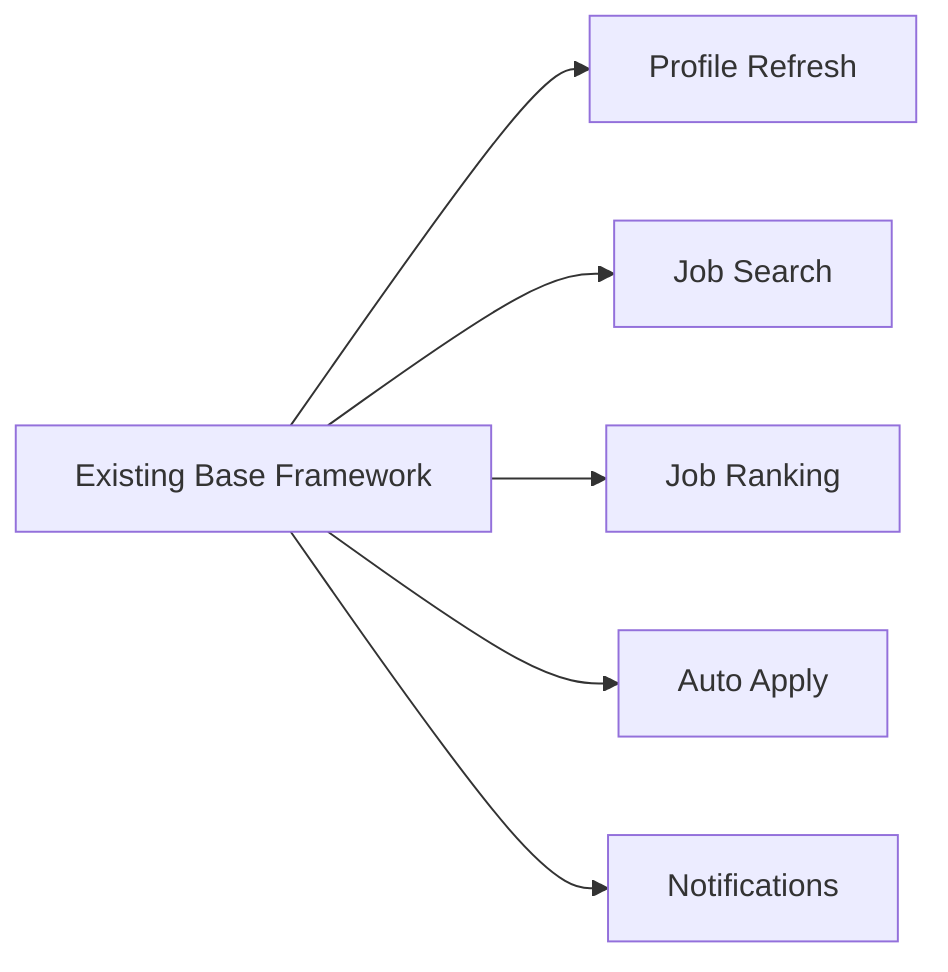

# Naukri Automation Workflow

This document explains the current framework in visual form so it is easy to understand what is already working and how each file connects.

## 1. Current Framework Structure

```text
naukri-automation/
├── .env
├── playwright.config.js
├── package.json
├── auth/
│   └── naukri-user.json
├── fixtures/
│   └── testFixture.js
├── locators/
│   ├── auth/
│   │   └── login.locators.js
│   ├── common/
│   │   └── home.locators.js
│   ├── jobs/
│   │   ├── jobApply.locators.js
│   │   └── jobSearch.locators.js
│   └── profile/
│       └── profile.locators.js
├── pages/
│   ├── auth/
│   │   └── LoginPage.js
│   ├── common/
│   │   └── HomePage.js
│   ├── jobs/
│   │   ├── JobApplyPage.js
│   │   └── JobSearchPage.js
│   └── profile/
│       └── ProfilePage.js
├── test-data/
│   └── jobs/
│       └── searchCriteria.json
├── tests/
│   ├── jobs/
│   │   └── searchAndApply.spec.js
│   └── profile/
│       └── updateProfile.spec.js
└── utils/
    ├── authState.js
    ├── env.js
    ├── jobMatcher.js
    ├── jobScreeningAnswers.js
    ├── logger.js
    └── screenshot.js
```

## 2. High-Level Architecture



## 3. Auth and Session Reuse Flow



## 4. Profile Refresh Flow



## 5. Job Search and Apply Flow



## 6. Runtime File Connection



## 7. What Each Main File Does

| File | Responsibility |
|---|---|
| `playwright.config.js` | Central Playwright setup, reporter config, timeouts, browser options, and saved auth state loading. |
| `fixtures/testFixture.js` | Creates reusable page object instances for every test. |
| `pages/auth/LoginPage.js` | Login and session reuse logic. |
| `pages/common/HomePage.js` | Navigation from signed-in home to profile page. |
| `pages/profile/ProfilePage.js` | Profile edit, save, and success verification actions. |
| `pages/jobs/JobSearchPage.js` | Opens results page, applies filters, and collects matching job links. |
| `pages/jobs/JobApplyPage.js` | Opens job detail pages, clicks Apply, handles popups, answers screening questions, and records outcome. |
| `locators/**/*.js` | Keeps selectors separated from business logic. |
| `utils/env.js` | Loads and validates `.env` values. |
| `utils/authState.js` | Manages the saved logged-in session file path. |
| `utils/jobMatcher.js` | Filters collected jobs so only relevant titles are processed. |
| `utils/jobScreeningAnswers.js` | Provides positive, professional answers for visible screening fields. |
| `utils/logger.js` | Writes readable execution logs in terminal output. |
| `utils/screenshot.js` | Captures screenshots for skipped or unclear application cases. |
| `test-data/jobs/searchCriteria.json` | Stores keywords, experience, locations, and limits outside the test code. |

## 8. Real Working Sequence

### Profile module

1. Test starts.
2. `.env` is loaded.
3. Existing auth state is reused if valid.
4. If not valid, login is performed once.
5. Profile page is opened.
6. Edit is clicked.
7. Save is clicked.
8. Success message is verified.

### Jobs module

1. Test starts.
2. `.env` and auth state are loaded.
3. Logged-in session is reused.
4. For each keyword, the results URL is opened directly.
5. Location filters are applied.
6. Freshness is set to `Last 1 day`.
7. Visible jobs are collected from the results page.
8. Job titles are filtered for relevance.
9. Each selected job is opened.
10. Apply is attempted.
11. Popups and screening questions are handled.
12. Result is recorded as applied, already-applied, skipped, or needs-review.

## 9. Simple Mental Model

Think of the framework in this order:

```text
Config -> Test -> Fixture -> Page Object -> Locator + Utility -> Browser Action -> Verification
```

That means:

- `config` decides how Playwright runs
- `test` decides what business flow to execute
- `fixture` gives ready-to-use objects
- `page object` contains user actions
- `locator` contains selectors
- `utility` contains helpers
- browser executes the real steps on Naukri

## 10. Which Parts Are Already Working

- Login with `.env` credentials
- Session reuse with `auth/naukri-user.json`
- Profile refresh flow
- Job search flow
- Location and freshness filters
- Apply attempt flow
- Resume-later popup handling
- Basic screening-question handling
- Screenshot capture for unclear cases

## 11. Future Modules Can Fit Here



This is why the project is separated into `tests`, `pages`, `locators`, `fixtures`, `utils`, and `test-data`.
